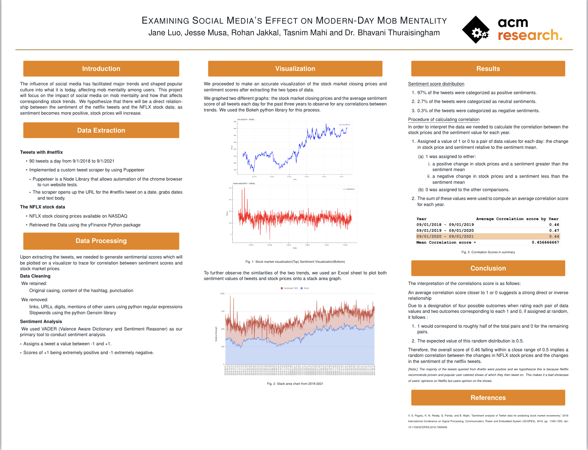

# Examining Social Media’s Effect on Modern-Day Mob Mentality

## Research Poster
The research poster below details our process and results.

# Purpose
The purpose of this project is to analyze the large-scale effects of modern-day social media and how its growing popularity and use has affected “mob mentality,” also known as crowd theory, through research on the role of websites, such as Twitter, in influencing recent financial and economic trends.
We chose to focus our research on the company Netflix. Netflix is currently the world’s most popular streaming service in the world with over 207 million subscribers. We analyzed how Netflix’s corresponding stocks and tweets containing #netflix correlate with each other.

## Mob Mentality Website
[acmresearch.ml](https://acmresearch.ml/)

# Data
We used two types of data, the NFLX stock data and sentiment scores of user tweets containing #netflix on the Twitter platform. The time period of both the tweets and the prices ranged from September 1st, 2018 to September 1st, 2021.

## NFLX Stock market closing prices
The NFLX stock data was retrieved from historical daily stock prices available on NASDAQ using the yfinance Python package. The dataset consists of opening, closing, high, and low stock NFLX prices. This research focused on the closing stock prices for each day.

## Twitter Data extraction
We implemented a custom scraper using Puppeteer, a Node Library that can automate the chrome browser to run website tests. We selected advanced search query options and used the scraper to open up the url for tweets containg #netflix on a certain date and iterate through each of the tweet containers on that page. During each iteration, the dates and the text bodies of each tweet were stored into a CSV file.

# Data Processing
## Data Cleaning
We retained the original casing and the punctuations because capitalized letters and exclamations can illustrate strong emotions or emphasis. However, links, urls, symbols, digits, and mentions of other users in the tweets were removed. Stopwords were also removed because they posed no influence on the actual sentiment of the tweet. In this research we used the Python Gensim library’s remove_stopwords() function. 

## Sentimental Analysis
VADER was used in this research to conduct sentiment analysis in the tweets, with an accuracy rate of approximately 56%. This tool tells us not only if a text is positive or negative but also determines how positive or negative a text is by giving us a decimal value between -1 and 1. Approximately 97% of the tweets were categorized as positive sentiments  2.70% were categorized as negative, and only 0.3% of the tweets were categorized as negative sentiments. 

# Visualization
We visualized our findings by graphing two different graphs using the Bokeh Python library. One graph contained the stock market closing prices over time and the other contained average sentiment score of tweets over time. 

# Results
## Correlation Calculation

We assigned a value of 1 or 0 to a pair of data values for each day, the pair of values being the change in stock price and sentiment relative to the sentiment mean. We assigned 1 to when the stock increased from the previous day and the sentiment is above the sentiment mean or when the stock decreased from the previous day and the sentiment was below the sentiment mean. 0 was assigned to the other comparisons. 

The sum of these values were then used to compute an average correlation score for each year and an overall correlation score. An average correlation score closer to 1 suggests a strong direct relationship between the changes in stock prices and the relative sentiment, and a score closer to 0 suggests a strong inverse relationship. There were four possible outcomes when rating each pair of data values, with two outcomes corresponding to 1, and two corresponding to 0. If these outcomes were randomly assigned, we would expect that about half of the data pairs would be assigned 1 and the other half would be assigned 0, so the expected value of this random distribution would be 0.5. 
The sum of these values were used to compute an average correlation score.The overall correlation score was 0.46.

# Conclusion
Our overall correlation score of 0.46 falling close to 0.5 implies a that there is a random correlation between the changes in NFLX stock prices and the relative sentiment of the hashtag netflix tweets. The majority of the tweets queried from #neflix were positive and we hypothesize this is because Netflix recommends proven and popular shows user catered based on the personalized recommendation algorithm, of which they then tweet on. This makes it a bad showcase of users opinion on Netflix.

# Resources
## Research Sources
- V. S. Pagolu, K. N. Reddy, G. Panda and B. Majhi, "Sentiment analysis of Twitter data for predicting stock market movements," 2016 International Conference on Signal Processing, Communication, Power and Embedded System (SCOPES), 2016, pp. 1345-1350, doi: 10.1109/SCOPES.2016.7955659.

## Python libraries
- yFinance
- Gensim
- Bokeh
- Pandas
- Numpy
- Python NLTK
- SentimentIntensityAnalyzer

## Other
- Node.js
- Puppeteer

# Contributors
- [Jane Luo](https://github.com/jane-luo)
- [Jesse Musa](https://github.com/jesse51002)
- [Rohan Jakkal](https://github.com/SharpPig)
- [Tasnim Mahi](https://github.com/mahimahithefish)
- [Abby Thomas](https://github.com/thomasabigail) - Research Lead
- [Dr. Bhavani Thuraisingham](https://personal.utdallas.edu/~bhavani.thuraisingham/) - Faculty Advisor
